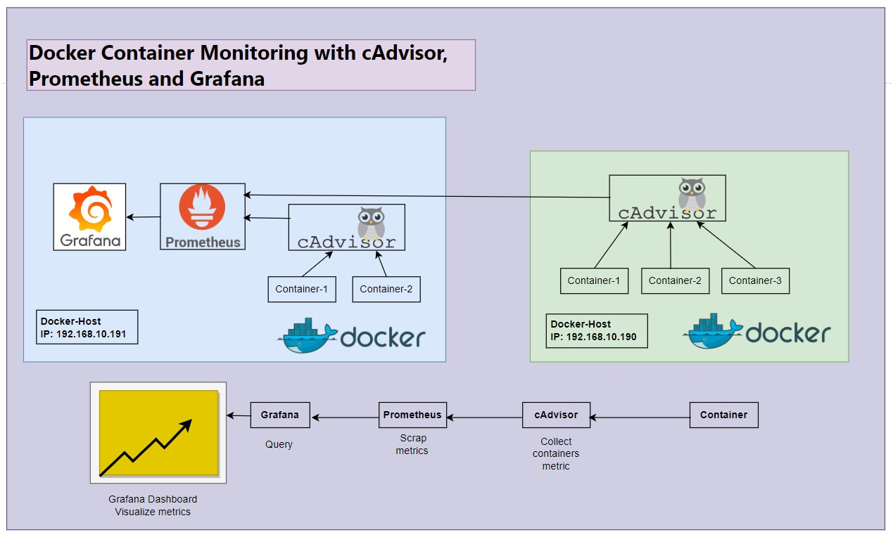
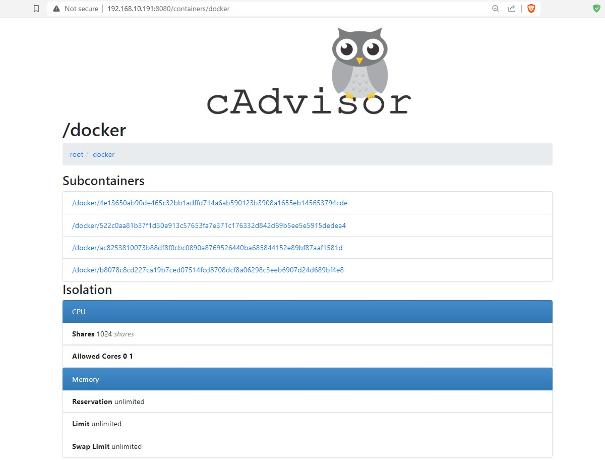
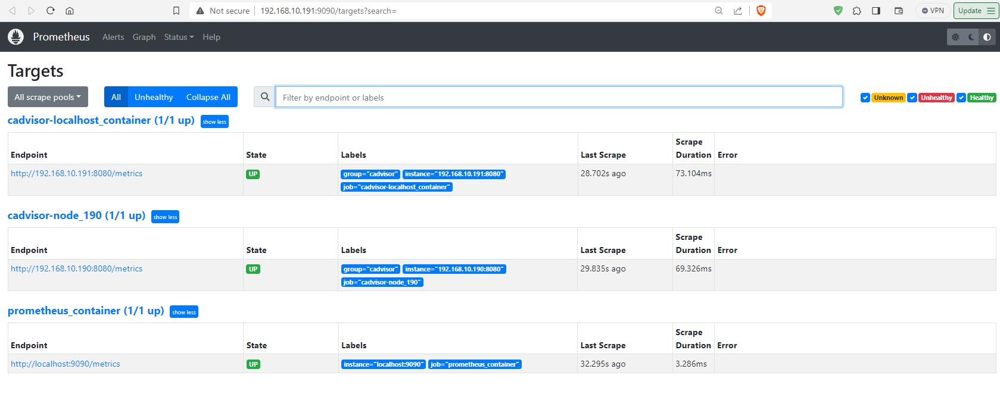
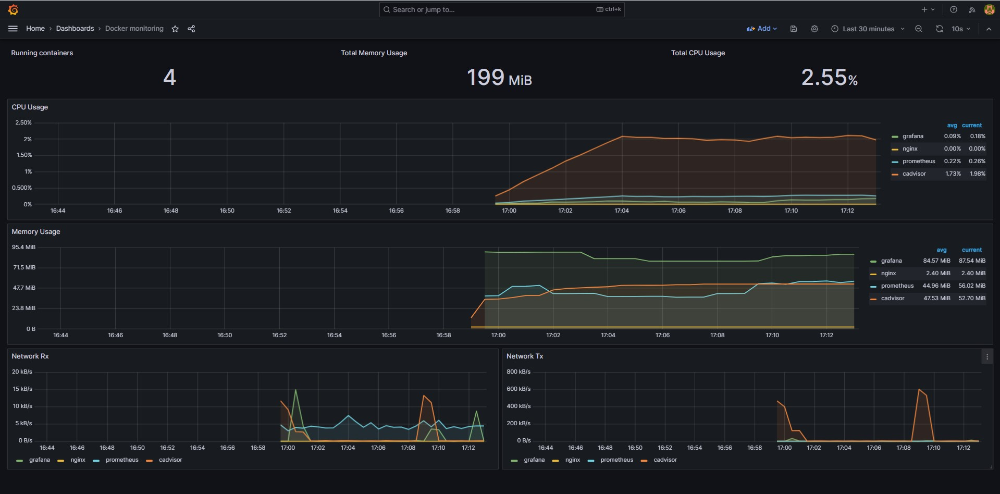

# Docker Container Monitoring with cAdvisor, Prometheus and Grafana:
Monitoring Docker containers is crucial for maintaining the health and performance of your containerized applications. There are several tools and techniques you can use to monitor Docker containers effectively.

Remember that the choice of monitoring tools and techniques may vary depending on your specific requirements and the scale of your containerized infrastructure.



### Prerequisites:
- A Linux server (CentOS, Ubuntu or any other distribution).
- Docker installed on your system.
- Basic knowledge of command-line tools.


### _Docker stats_ Command:

Docker provides a built-in _docker stats_ command that allows you to view real-time CPU, memory, and network usage statistics for running containers. You can use this command to get a quick overview of container resource usage.

```
docker stats [container_name_or_id]
```

Keep in mind that the docker stats command is primarily for real-time monitoring on your terminal. To collect and store historical container metrics for more in-depth analysis, you may want to consider using container monitoring solutions like Prometheus, cAdvisor, or third-party tools.

### cAdvisor:
cAdvisor, which stands for "Container Advisor," is an open-source container monitoring tool developed by Google. It is designed to provide real-time, detailed, and resource-level metrics for Docker containers and other container runtimes.

### Prometheus:
Prometheus is an open-source systems monitoring and alerting toolkit originally built at SoundCloud. It has become one of the leading solutions for collecting, storing, and querying time-series data, making it a popular choice for monitoring and observability in modern cloud-native and containerized environments.


### Grafana:
Grafana is an open-source observability and visualization platform that is widely used for monitoring, analytics, and interactive dashboards. It is designed to help users query, visualize, and alert on metrics and logs, making it an essential tool for monitoring and observability in a wide range of environments.

### Pre-work of cAdvisor, Prometheus and Grafana:

Here is a look at the docker-compose and file structure with all the configuration files:

### Pull Docker Images: 

```
docker pull gcr.io/google-containers/cadvisor:latest
docker pull prom/prometheus
docker pull grafana/grafana
```

```
# docker images

REPOSITORY                          TAG       IMAGE ID       CREATED       SIZE
grafana/grafana                     latest    31656ec60d2e   12 days ago   391MB
prom/prometheus                     latest    9c703d373f61   3 weeks ago   245MB
gcr.io/google-containers/cadvisor   latest    d24b7db72c99   4 years ago   185MB

```

### Create a Docker Network: 
It's a good practice to create a Docker network to allow cAdvisor, Prometheus and Grafana containers to communicate with each other. Run the following command to create a network:

```
docker network create monitoring
```

### Create a persistent volume:
Create a persistent volume for grafana data (recommended): 

``` 
docker volume create grafana_data
```

### Create configuration and data storage directory:  
```
mkdir prometheus/conf/
mkdir prometheus/prometheus_data/

mkdir grafana/conf/
mkdir grafana/grafana_data/
```

### Configure Prometheus YAML File: 
Add scrape configurations for your targets in the "_scrape_configs_" section. Edit the Prometheus configuration file (prometheus.yml) to define your targets (the services you want to monitor). 

Here's an example configuration for monitoring a docker containers:

```
vim prometheus/conf/prometheus.yml

global:
  scrape_interval: 15s
      
scrape_configs: 
  - job_name: 'prometheus_container' 
    # metrics_path defaults to '/metrics'
    scrape_interval: 5s 
    static_configs: 
      - targets: ['localhost:9090']
        
  - job_name: 'cadvisor-localhost_container'
    scrape_interval: 5s
    metrics_path: '/metrics'
    static_configs:
      - targets: ['192.168.10.191:8080']
        labels:
          group: 'cadvisor'
          
  - job_name: 'cadvisor-node_190' # other docker host
    scrape_interval: 5s
    metrics_path: '/metrics'
    static_configs:
      - targets: ['192.168.10.190:8080']
        labels:
          group: 'cadvisor'


Save and Quit
```


### Create environment variable file: 
In a Docker-based deployment of Grafana, you can use environment variables to configure Grafana without modifying the Grafana configuration file (grafana.ini) directly. This approach allows you to easily customize Grafana's settings when launching a Grafana container. To do this, you can create a .env file or specify environment variables directly in your Docker Compose file.

``` 
vim .env 

#Grafana Admin user pass:
GF_SECURITY_ADMIN_PASSWORD=admin123

Save and Quit
```


### Create a Docker Compose file:
Creating a Docker Compose file to run cAdvisor, Prometheus and Grafana together is a convenient way to manage the setup. Below is a basic Docker Compose configuration that sets up cAdvisor, Prometheus and Grafana in separate containers:

```
vim docker-compose.yml

version: '3'
services:
  cadvisor:
    image: gcr.io/google-containers/cadvisor
    container_name: cadvisor
    restart: always
    networks:
      - monitoring
    ports:
      - "8080:8080"
    volumes: 
      - "/:/rootfs"
      - "/var/run:/var/run"
      - "/sys:/sys"
      - "/var/lib/docker/:/var/lib/docker"
      - "/dev/disk/:/dev/disk"
    privileged: true
    devices: 
      - "/dev/kmsg"

  prometheus:
    image: prom/prometheus
    container_name: prometheus
    restart: always
    networks:
      - monitoring
    ports:
      - '9090:9090'
    user: '0'
    volumes:
      - ./prometheus/conf:/etc/prometheus
      - ./prometheus/prometheus_data:/prometheus
    depends_on:
      - cadvisor
      
  grafana:
    image: grafana/grafana
    container_name: grafana
    restart: always
    networks:
      - monitoring
    ports:
      - '3000:3000'
    user: '0'
    volumes:
      #- grafana_data:/var/lib/grafana
      - ./grafana/grafana_data:/var/lib/grafana
    environment:
      - GF_SECURITY_ADMIN_PASSWORD=${GF_SECURITY_ADMIN_PASSWORD}
    depends_on:
      - prometheus
      
networks:
  monitoring:
    external: true

volumes:
  grafana_data:
    external: true


Save and Quit
```


### Directory Structure: 
```
# ll -a
-rw-r--r-- 1 root root  1196 Oct  1 14:51 docker-compose.yml
-rw-r--r-- 1 root root    63 Oct  1 13:36 .env
drwxr-xr-x 4 root root  4096 Oct  1 11:59 grafana
drwxr-xr-x 4 root root  4096 Oct  1 11:59 prometheus
-rw-r--r-- 1 root root 11471 Oct  1 15:19 README.md


# tree
.
├── docker-compose.yml
├── grafana
│   ├── conf
│   └── grafana_data
├── prometheus
│   ├── conf
│   │   └── prometheus.yml
│   └── prometheus_data
└── README.md


```


### Dry-run for verify Docker Compose file:
A dry run for verifying a Docker Compose file involves checking the syntax and structure of the Compose file without actually running any containers. 

```
docker-compose -f docker-compose.yml config 
```

### Run the Docker Compose file:
This command will create and start the containers in the background:

```
docker-compose up -d
```

### Verify Container: 

```
docker-compose ps

   Name                 Command                  State               Ports
-----------------------------------------------------------------------------------
cadvisor     /usr/bin/cadvisor -logtostderr   Up (healthy)   0.0.0.0:8080->8080/tcp
grafana      /run.sh                          Up             0.0.0.0:3000->3000/tcp
prometheus   /bin/prometheus --config.f ...   Up             0.0.0.0:9090->9090/tcp
```


### Run Nginx for Testing:

```
docker run --name nginx -dit -p 80:80 nginx
```


# We can also run as container using this command: 

<details>
  <summary>Create Container (Optional) </summary>


### Run cAdvisor (Container Advisor):

To run cAdvisor (Container Advisor) as a Docker container, you can use the following Docker command:

```
docker run --name cadvisor -dit -p 8080:8080 --network monitoring --volume=/:/rootfs:ro --volume=/var/run:/var/run:ro --volume=/sys:/sys:ro --volume=/var/lib/docker/:/var/lib/docker:ro --volume=/dev/disk/:/dev/disk:ro --detach=true gcr.io/google-containers/cadvisor:latest
```


### Run Prometheus Container: 
Run the Prometheus container using Docker, mounting the prometheus.yml configuration file:

```
docker run --name prometheus -dit -p 9090:9090 --network monitoring --user "$(id -u)" -v "./prometheus/conf:/etc/prometheus" -v "./prometheus/prometheus_data:/prometheus" prom/prometheus

```

### Run Grafana Container: 
Run the Grafana container:

```
docker run --name grafana -dit -p 3000:3000 --network monitoring --user "$(id -u)" -v "./grafana/grafana_data:/var/lib/grafana" -e "GF_SECURITY_ADMIN_PASSWORD=admin123" grafana/grafana

```

### Verify Container: 

```
docker ps

CONTAINER ID   IMAGE                                      COMMAND                  CREATED          STATUS                   PORTS                    NAMES
5b2a9b96510a   grafana/grafana                            "/run.sh"                10 seconds ago   Up 9 seconds             0.0.0.0:3000->3000/tcp   grafana
6999c6c4d9f5   prom/prometheus                            "/bin/prometheus --c…"   21 seconds ago   Up 19 seconds            0.0.0.0:9090->9090/tcp   prometheus
f63e20c1b077   gcr.io/google-containers/cadvisor:latest   "/usr/bin/cadvisor -…"   9 minutes ago    Up 9 minutes (healthy)   0.0.0.0:8080->8080/tcp   cadvisor
```

</details>

---


### cAdvisor web console
Once the cAdvisor container is running, you can access the web console by opening a web browser and navigating to:- http://YOUR_IP:8080




### Prometheus web console:
Access Prometheus at http://YOUR_IP:9090/targets





### Grafana Data Source Setup:
Access the Grafana web interface at http://YOUR_IP:3000 in your web browser. Log in to Grafana using the credentials: 

1. Click on the Navigation Menu (☰)in the top-left sidebar to access the "Connections" section.

2. Click "Data Sources," then click on "Add data source."

3. Choose "Prometheus" as the data source type.

4. Configure the Prometheus data source:

    - **Name**: Prometheus
    - **Prometheus server URL**: http://YOUR_IP:9090
    - Click **"Save & Test"** to ensure the data source is working correctly.


### Grafana Dasboard Setup:
Here, Grafana Dashboard ID on 193, This is a dashboard for monitoring Docker container metrics collected by cAdvisor.

1. Click on the Navigation Menu (☰)in the top-left sidebar to access the "Dashboards" section.

2. Under **New** Click down arrow then click **Import**. 

3. Under Import dashboard: Import via grafana.com
    - Choose Your "Grafana.com Dashboard URL or ID": 193
    - Click **Load**.
    - Then select "prometheus with cAdvisor as a terget": Prometheus (default).
    - After that click **Import**.
4. Save your dashboard when you're done.


### Grafana web console:



Now you have a basic setup of cAdvisor, Prometheus and Grafana for docker metrics monitoring. 

